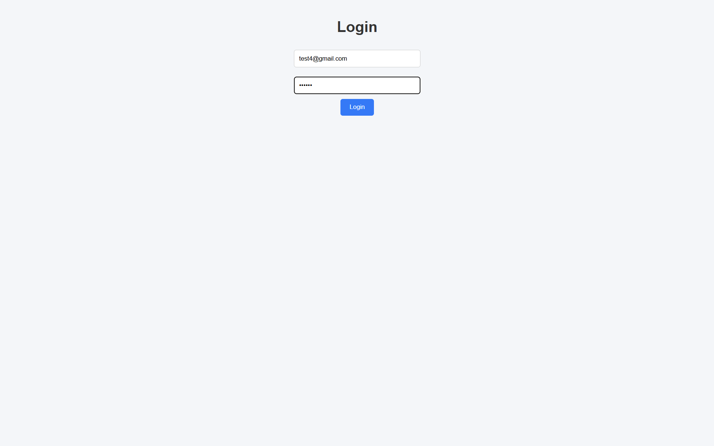

# Full Stack Auth Application

## 🚀 Overview

This project is a full-stack application built using **CodeIgniter 4** (backend) and **ReactJS** (frontend). It includes authentication using **JWT tokens** and demonstrates relational database handling.

## 🛠 Tech Stack

* Backend: CodeIgniter 4 (PHP)
* Frontend: ReactJS
* Database: MySQL
* Authentication: JWT

## 🔐 Features

* User Registration (with teacher details)
* Login with JWT authentication
* Protected APIs using token
* Users & Teachers data tables
* Clean UI Dashboard

## 📂 Project Structure

* backend/ → CodeIgniter API
* frontend/ → React Application

## ⚙️ How to Run

### Backend

```bash
cd backend
php spark serve
```

### Frontend

```bash
cd frontend
npm install
npm start
```

## 🌐 API Endpoints

* POST /login
* POST /create-teacher
* GET /users
* GET /teachers
## 📸 Screenshots

### 🔐 Login Page


### 📊 Dashboard

## 👨‍💻 Author

Srivathsav Pittala
